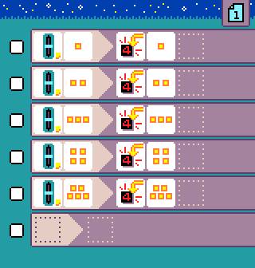

{:class="sample"}

This program requires a [Jacdac slider module](https://microsoft.github.io/jacdac-docs/devices/kittenbot/sliderv10/).
The slider tile maps the position of the slider to values 1-5, where 1 means the slider is at its minimum position and 5 means the slider is at its maximum position. The program simply displays the position of the slider on the LED screen.

-   [Open in MicroCode](/microcode/#H4sIAKCjLGUAA/NKywwOyEjx9zUtjgip8k92M3SsygtKCfI1NYkIzfJPcwx0dQJiRwDRxewIKAAAAA==)
