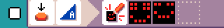
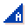
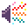

{:class="icon-sample"}

{:class="sample"}

The goal of this program is to show a smiley and plays a happy sound
when pressing A, and a frowney animation and unhappy sound when B is pressed.

{:class="rule"}

-   **when** {:class="icon"} press {:class="icon"} button A, **do** {:class="icon"} show image smiley.

{:class="rule"}

-   **when** {:class="icon"} press {:class="icon"} button A, **do** {:class="icon"} play sound emoji {:class="icon"} happy.

{:class="rule"}

-   **when** {:class="icon"} press {:class="icon"} button B, **do** {:class="icon"} show image frowney.

{:class="rule"}

-   **when** {:class="icon"} press {:class="icon"} button A, **do** {:class="icon"} play sound emoji {:class="icon"} sad.

#### improvement ideas

-   add more feelings with other buttons and sensors

## Video

<video class="sample" poster="../videos/head-or-tail.png" src="../videos/smiley-buttons.mp4" controls="true"></video>
