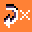

# {:class="icon-sample"} Smiley Buttons

{:class="sample"}

The goal of this program is to show a smiley
when pressing A, and a frowney animation (2 frames) that repeats 3 times when
pressing B.

{:class="rule"}

-   **when** {:class="icon"} press {:class="icon"} button A, **do** {:class="icon"} show image smiley.

{:class="rule"}

-   **when** {:class="icon"} press {:class="icon"} button B, **do** {:class="icon"} show image frowney, and {:class="icon"} repeat {:class="icon"} 3 times.

#### improvement ideas

-   add sound emoji for each buttons to make it more lively
