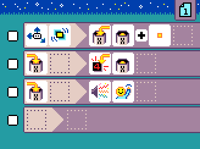
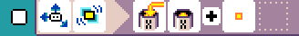

{:class="sample"}

This program counts your steps by measuring the shake events (heavy steps!).

-   [Open in MicroCode](/microcode/#H4sIAKCjLGUAA/NKywwOSDdM9PU2SnKt8i9xrczNcQx0dQJiRwBim90NHAAAAA==)

{:class="rule"}

-   **when** {:class="icon"} {:class="icon"} shake, **do** {:class="icon"} set variable `X` to {:class="icon"} variable `X` plus {:class="icon"} `value 1`

{:class="rule"}

-   **when** {:class="icon"} variable X changed, **do** show variable `X` value.
