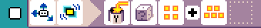
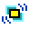
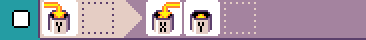
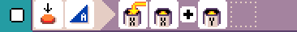

# Times Table

{:class="sample"}

This is a variation of the [counter sample](./counter.md) where we increment by a random number
instead of just 1. This is a fun program to pratice times table.

The variable `Y` is used to hold the random multiplier and the variable `X`
is used for the counter. Every time the user presses `A`, we add `X + Y` and store it in `X`.

-   [Open in MicroCode](/microcode/#H4sIAMG4UGMAA4VQ246CMBD9JcRkNzwKIew01IZtQXbfBCQUizFBhfr1Di3Gy4tPk9M5t85Ok6HsvMN/lHXQHr9BrSRTJ5wwT4qzl+mVypwPMuHwtdHEZykY/CsNjqio6tJtmq2bmndheWvagowDsmYcetg7Iw1IVfPxyVcFoBzchQYnQvkWOwYLAUMi3zU2+9ElfO2iSTVl4n8K9NE0DE0H2vqYtfDiH/TQhivu2rsXFau3/j72+aDBfk95I9s0qojGi9WdvDx3erwzn/a75WL+i71vnc3eU/flzDWcQVZdpktXXQrcweFPx21yZgHxbsHHo6K0AQAA)

{:class="rule"}

-   **when** {:class="icon"} {:class="icon"} shake, **do** {:class="icon"} set variable X to {:class="icon"} random number between 1 and {:class="icon"} {:class="icon"} 10 .

{:class="rule"}

-   **when** {:class="icon"} variable X changed, **do** {:class="icon"} set variable `X` to [get variable Y](../images/generated/icon_M20B.png){:class="icon"} variable `Y`

{:class="rule"}

-   **when** {:class="icon"} press {:class="icon"} button A, **do** {:class="icon"} set variable `X` to {:class="icon"} variable `X` plus {:class="icon"} variable `Y`

{:class="rule"}

-   **when** {:class="icon"} variable X changed, **do** show variable `X` value.
